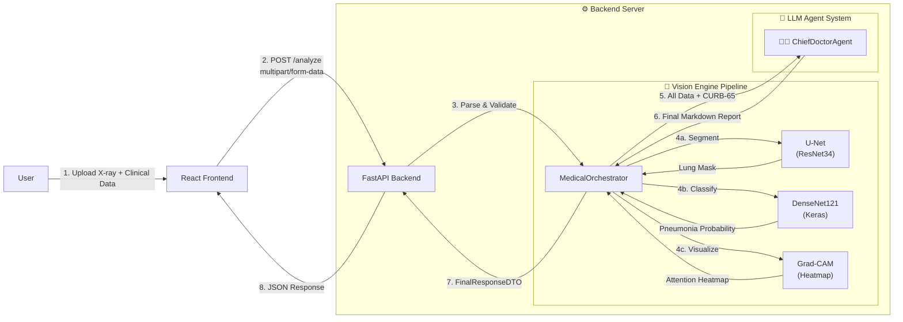

<div align="center">

# 🫁 PneumoScan AI — Hệ Thống Trợ Lý Chẩn Đoán Hình Ảnh Y Tế Đa Phương Thức

> **Ứng dụng Trí tuệ Nhân tạo kết hợp Computer Vision (U-Net Segmentation, DenseNet121 Classification, Grad-CAM Visualization) và Large Language Model (LLM) để hỗ trợ bác sĩ chẩn đoán viêm phổi từ ảnh X-quang ngực và dữ liệu lâm sàng.**


-06B6D4?style=for-the-badge&logo=tailwindcss&logoColor=white)


-F55036?style=for-the-badge&logo=meta&logoColor=white)

</div>

---

## 📖 Mục Lục

| # | Mục | Mô tả |
|---|-----|--------|
| 1 | [Giới Thiệu Tổng Quan](#1--giới-thiệu-tổng-quan) | Bối cảnh bài toán, mục tiêu và phạm vi dự án |
| 2 | [Kiến Trúc Hệ Thống](#2-%EF%B8%8F-kiến-trúc-hệ-thống) | Sơ đồ kiến trúc tổng thể và luồng dữ liệu |
| 3 | [Công Nghệ Sử Dụng](#3--công-nghệ-sử-dụng) | Tech Stack chi tiết cho Frontend, Backend và AI Engine |
| 4 | [Cấu Trúc Thư Mục](#4--cấu-trúc-thư-mục) | Sơ đồ cây thư mục và giải thích chức năng |
| 5 | [Phân Tích Module Chức Năng](#5--phân-tích-các-module-chức-năng) | Đặc tả kỹ thuật chi tiết từng module |
| 6 | [Thiết Kế Dữ Liệu (DTO)](#6--thiết-kế-dữ-liệu-dto--data-transfer-objects) | Cấu trúc các Data Transfer Objects |
| 7 | [Hướng Dẫn Cài Đặt & Chạy](#7--hướng-dẫn-cài-đặt--chạy-ứng-dụng) | Các bước cấu hình môi trường và khởi chạy |
| 8 | [Hướng Dẫn Sử Dụng](#8--hướng-dẫn-sử-dụng) | Quy trình thao tác trên giao diện |
| 9 | [Demo Trực Tuyến](#9--demo-trực-tuyến) | Link ứng dụng đã triển khai |

---

## 1. 📖 Giới Thiệu Tổng Quan

### 1.1. Bối Cảnh Bài Toán

Viêm phổi là một trong những nguyên nhân gây tử vong hàng đầu trên thế giới, đặc biệt tại các quốc gia đang phát triển. Việc chẩn đoán viêm phổi qua ảnh X-quang ngực phụ thuộc nhiều vào kinh nghiệm và trình độ chuyên môn của bác sĩ chẩn đoán hình ảnh. Trong bối cảnh quá tải y tế, nhu cầu về một hệ thống **hỗ trợ ra quyết định lâm sàng (Clinical Decision Support System - CDSS)** ứng dụng AI là vô cùng cấp thiết.

### 1.2. Mục Tiêu Dự Án

**PneumoScan AI** được thiết kế nhằm:

- **Hỗ trợ bác sĩ** trong việc phát hiện viêm phổi trên ảnh X-quang ngực, **không thay thế** quy trình chẩn đoán y khoa truyền thống.
- **Phân tích đa phương thức (Multimodal Analysis)**: Kết hợp dữ liệu hình ảnh (X-quang) với dữ liệu lâm sàng (sinh hiệu, xét nghiệm máu) để đưa ra đánh giá toàn diện.
- **Trực quan hóa vùng nghi ngờ bằng Grad-CAM**: Tạo bản đồ nhiệt (heatmap) hiển thị vùng ảnh mà mô hình AI tập trung phân tích, giúp bác sĩ hiểu quyết định của AI.
- **Tự động hóa tính điểm CURB-65/CRB-65**: Hỗ trợ phân tầng mức độ nghiêm trọng và đưa ra định hướng xử trí (Ngoại trú / Nhập viện).
- **Sinh báo cáo y khoa tự động** bằng Mô hình Ngôn ngữ Lớn (LLM), tuân thủ định dạng chuyên ngành.

### 1.3. Phạm Vi Hệ Thống

| Thành phần | Mô tả |
|---|---|
| **Phân Vùng (Segmentation)** | Tách vùng phổi khỏi cấu trúc xương/mô mềm bằng U-Net (ResNet34 backbone) |
| **Phân Loại (Classification)** | Xác định xác suất viêm phổi từ ảnh X-quang bằng DenseNet121 |
| **Trực Quan Hóa (Grad-CAM)** | Tạo bản đồ nhiệt (heatmap) trên DenseNet121 để hiển thị vùng ảnh AI quan tâm |
| **Lập Luận Y Khoa (Reasoning)** | Tổng hợp kết quả và sinh báo cáo bằng LLM Llama 3.3 70B (Groq Cloud) |
| **Đánh Giá Rủi Ro** | Tự động tính điểm CURB-65 / CRB-65, phân tầng nguy cơ |

---

## 2. 🏗️ Kiến Trúc Hệ Thống

### 2.1. Kiến Trúc Tổng Thể (High-Level Architecture)

Hệ thống được thiết kế theo mô hình **Client-Server**, trong đó:
- **Frontend (React + Vite)**: Giao diện nhập liệu và hiển thị kết quả.
- **Backend (FastAPI)**: API Gateway, điều phối AI Engine, xử lý logic nghiệp vụ.
- **AI Engine**: Bao gồm Vision Models Pipeline (U-Net + DenseNet121 + Grad-CAM) và LLM Agent (ChiefDoctorAgent).



### 2.2. Luồng Xử Lý Dữ Liệu (Data Flow)

Dưới đây là luồng xử lý chi tiết khi người dùng thực hiện một lượt phân tích:

```
┌─────────────────────────────────────────────────────────────────────────┐
│                         LUỒNG XỬ LÝ CHÍNH                              │
├─────────────────────────────────────────────────────────────────────────┤
│                                                                         │
│  [1] USER nhập dữ liệu lâm sàng + Upload ảnh X-quang                  │
│       │                                                                 │
│  [2] Frontend gửi POST /analyze (FormData: file + JSON clinical data)  │
│       │                                                                 │
│  [3] Backend parse JSON → PatientDataDTO, đọc ảnh → PIL.Image          │
│       │                                                                 │
│  [4] MedicalOrchestrator.analyze_patient() được gọi:                   │
│       │                                                                 │
│       ├── [4a] U-Net: predict_mask(image)                              │
│       │    ├── Tính mask_area_ratio, count_blobs                       │
│       │    ├── Nếu mask hợp lệ → crop_lung_region()                   │
│       │    └── Nếu mask lỗi → FALLBACK (dùng ảnh gốc)                 │
│       │                                                                 │
│       ├── [4b] DenseNet121: predict_pneumonia_prob(processed_image)     │
│       │    └── Output: float (0-100%)                                  │
│       │                                                                 │
│       ├── [4c] Grad-CAM: generate_gradcam_heatmap(processed_image)     │
│       │    ├── Trích xuất feature maps từ lớp conv cuối DenseNet121    │
│       │    ├── Tính gradient → Tạo heatmap attention                   │
│       │    └── Overlay heatmap (JET colormap, alpha=0.4) lên ảnh gốc  │
│       │                                                                 │
│       ├── [5] Tính điểm CURB-65/CRB-65 từ dữ liệu lâm sàng           │
│       │                                                                 │
│       └── [6] ChiefDoctorAgent.conclude(patient_data, prob, curb)      │
│            └── Gửi JSON tổng hợp cho LLM → Nhận Markdown Report       │
│                                                                         │
│  [7] format_ui_response() → JSON Response gửi về Frontend              │
│       │                                                                 │
│  [8] Frontend render: Ảnh annotated (Grad-CAM) + Báo cáo Markdown     │
│                                                                         │
└─────────────────────────────────────────────────────────────────────────┘
```

### 2.3. ChiefDoctorAgent — LLM Agent

Hệ thống LLM sử dụng một **Agent duy nhất** (`ChiefDoctorAgent`) đóng vai trò Bác sĩ Trưởng khoa Hô hấp, chịu trách nhiệm tổng hợp toàn bộ dữ liệu và đưa ra báo cáo y khoa cuối cùng:

| Agent | Vai trò | Đầu vào | Đầu ra | Mô hình LLM |
|---|---|---|---|---|
| `ChiefDoctorAgent` | Bác sĩ Trưởng khoa Hô hấp | DenseNet probability, CURB-65 score, toàn bộ dữ liệu lâm sàng (JSON) | Báo cáo y khoa tổng hợp (Markdown) | Llama 3.3 70B |

**Đặc điểm thiết kế Prompt:**
- **Khóa cứng output format**: Agent chỉ được phép sử dụng định dạng Markdown được định nghĩa sẵn trong System Prompt (3 mục: Phân tích Lâm sàng, Nhận định tổng hợp, Giải thích chuyên môn).
- **Nguyên tắc không suy luận ngoài dữ liệu**: Agent chỉ suy luận dựa trên dữ liệu JSON được cung cấp, **tuyệt đối không** tự tạo thêm dữ liệu y tế hoặc suy đoán triệu chứng mới.
- **Tin tưởng tuyệt đối giá trị backend**: Sử dụng điểm CURB-65 đã được tính toán bởi hàm `calculate_curb65()`, không tự tính lại.
- **Quy tắc đánh giá CURB**: 0–1 → Nguy cơ Thấp; 2 → Nguy cơ Trung bình; ≥3 → Nguy cơ Cao.

---

## 3. 🛠 Công Nghệ Sử Dụng

### 3.1. Frontend

| Công nghệ | Phiên bản | Vai trò |
|---|---|---|
| **React** | 19.2.3 | Library xây dựng giao diện người dùng |
| **TypeScript** | ~5.8.2 | Đảm bảo type-safety cho dữ liệu y tế |
| **Vite** | 6.2.0 | Build tool & Dev server hiệu năng cao |
| **TailwindCSS** | CDN (forms, typography, aspect-ratio) | Styling responsive, hiện đại |
| **React Markdown** | 10.1.0 | Render báo cáo y khoa định dạng Markdown |
| **Remark GFM** | 4.0.1 | Hỗ trợ GitHub Flavored Markdown (bảng, checklist) |
| **Google Fonts (Inter)** | 300-700 | Typography chuyên nghiệp |
| **Material Symbols** | Outlined | Hệ thống icon y tế trực quan |

### 3.2. Backend

| Công nghệ | Vai trò |
|---|---|
| **FastAPI** | Python web framework hiệu năng cao, hỗ trợ async |
| **Uvicorn** | ASGI Server chạy ứng dụng FastAPI |
| **PyTorch** | Framework Deep Learning, chạy U-Net (Segmentation) |
| **TensorFlow / Keras** | Framework chạy DenseNet121 (Classification) + Grad-CAM |
| **Segmentation Models PyTorch (SMP)** | Thư viện Segmentation, cung cấp kiến trúc U-Net + ResNet34 encoder |
| **OpenCV (cv2)** | Xử lý ảnh: overlay Grad-CAM heatmap, resize, chuyển đổi màu |
| **Pillow (PIL)** | Xử lý ảnh I/O, chuyển đổi định dạng |
| **NumPy** | Tính toán ma trận, xử lý tensor |
| **Groq SDK** | Client gọi API Groq Cloud để sử dụng LLM Llama 3.3 70B |
| **python-dotenv** | Quản lý biến môi trường (.env) |
| **python-multipart** | Parse multipart/form-data (upload file) |

### 3.3. Mô Hình AI (Pre-trained Models)

| Mô hình | Kiến trúc | Kích thước File | Nhiệm vụ | Đầu vào | Đầu ra |
|---|---|---|---|---|---|
| `best_lung_unet.pth` | U-Net (ResNet34 encoder) | ~97 MB | Phân vùng phổi (Lung Segmentation) | Ảnh RGB 256×256 | Binary Mask 256×256 |
| `best_binary_xray_recall98.keras` | DenseNet121 | ~32 MB | Phân loại Viêm phổi (Binary Classification) + Grad-CAM | Ảnh RGB 224×224 | Xác suất [0, 1] + Heatmap |

---

## 4. 📂 Cấu Trúc Thư Mục

```
Multimodal_AI/
│
├── 📄 README.md                          # Tài liệu phân tích kỹ thuật (file này)
├── 📄 .gitignore                         # Cấu hình loại trừ file khỏi Git
├── 🐳 docker-compose.yml                # Docker Compose: khởi chạy toàn bộ hệ thống
├── 📄 .env.example                       # File .env mẫu cho Docker Compose
│
├── 🔧 backend/                           # ===== BACKEND (Python / FastAPI) =====
│   ├── 📄 main.py                        # Entry point: Khởi tạo FastAPI app, định nghĩa API endpoint
│   ├── 📄 config.py                      # Cấu hình toàn cục: đường dẫn model, ngưỡng, biến môi trường
│   ├── 📄 requirements.txt               # Danh sách thư viện Python cần cài đặt
│   ├── 📄 .env                           # Biến môi trường (GROQ_API_KEY, PORT, HOST)
│   ├── 🐳 Dockerfile                     # Docker image cho Backend
│   ├── 📄 .dockerignore                  # Loại trừ file khỏi Docker build context
│   │
│   ├── 🧠 ai_engine/                     # ===== CORE AI ENGINE =====
│   │   ├── 📄 orchestrator.py            # 🎯 Trung tâm điều phối: Gọi Vision → Agent → Response
│   │   ├── 📄 vision_models.py           # Lớp VisionEngine: Load & chạy U-Net, DenseNet121, Grad-CAM
│   │   ├── 📄 llm_client.py             # Client gọi Groq Cloud API (Llama 3.3 70B)
│   │   ├── 📄 prompts.py                # System Prompt cho ChiefDoctorAgent (Khóa cứng, tiếng Việt)
│   │   │
│   │   └── 🤖 agents/                    # ===== LLM AGENT =====
│   │       └── 📄 chief_doctor.py        # Agent: Bác sĩ Trưởng khoa Hô hấp (tổng hợp & chẩn đoán)
│   │
│   ├── 📦 core/                           # ===== DOMAIN LOGIC =====
│   │   ├── 📄 dtos.py                    # Data Transfer Objects (PatientDataDTO, FinalResponseDTO,...)
│   │   └── 📄 medical_calc.py            # Hàm tính điểm CURB-65 / CRB-65
│   │
│   ├── 🔧 utils/                          # ===== TIỆN ÍCH =====
│   │   ├── 📄 image_processing.py        # Xử lý ảnh: crop, mask analysis, tiện ích bounding box
│   │   └── 📄 response_helper.py         # Format response JSON cho Frontend
│   │
│   └── 🗂️ model_ai/                      # ===== PRE-TRAINED MODEL FILES =====
│       ├── 📄 best_lung_unet.pth         # U-Net (Segmentation)
│       └── 📄 best_binary_xray_recall98.keras  # DenseNet121 (Classification + Grad-CAM)
│
└── 🎨 frontend/                           # ===== FRONTEND (React + TypeScript) =====
    ├── 📄 index.html                      # HTML entry point (TailwindCSS CDN, Google Fonts, Import Map)
    ├── 📄 index.tsx                       # React DOM render root
    ├── 📄 App.tsx                         # Component gốc: State management, điều phối luồng chính
    ├── 📄 types.ts                        # TypeScript Interfaces (Vitals, Labs, ClinicalData, AnalysisResult)
    ├── 📄 constants.ts                    # Hằng số & Giá trị mặc định cho form nhập liệu
    ├── 📄 package.json                    # Dependencies & Scripts (npm)
    ├── 📄 tsconfig.json                   # Cấu hình TypeScript compiler
    ├── 📄 vite.config.ts                  # Cấu hình Vite (dev server port 3000, alias)
    ├── 🐳 Dockerfile                      # Docker image cho Frontend (multi-stage: build + Nginx)
    ├── 📄 nginx.conf                      # Cấu hình Nginx (SPA routing, reverse proxy API)
    ├── 📄 .dockerignore                   # Loại trừ file khỏi Docker build context
    │
    ├── 📦 components/                     # ===== REACT COMPONENTS =====
    │   ├── 📄 Header.tsx                  # Thanh header: Logo, tên hệ thống, trạng thái
    │   ├── 📄 InputPanel.tsx              # Panel nhập liệu: Upload ảnh, form dữ liệu lâm sàng
    │   └── 📄 ResultsPanel.tsx            # Panel kết quả: Ảnh annotated (Grad-CAM) + Báo cáo Markdown
    │
    └── 📦 services/                       # ===== API SERVICE LAYER =====
        └── 📄 geminiService.ts            # HTTP Client gọi Backend API (POST /analyze)
```

### Giải Thích Chức Năng Các Folder Chính

| Folder | Chức năng |
|---|---|
| `backend/` | Toàn bộ server-side: API Gateway, AI Pipeline, Logic nghiệp vụ y khoa |
| `backend/ai_engine/` | **Lõi AI**: Điều phối (Orchestrator), Vision Models (U-Net, DenseNet, Grad-CAM), LLM Client, và Agent |
| `backend/ai_engine/agents/` | Chứa ChiefDoctorAgent — Agent LLM duy nhất đóng vai Bác sĩ Trưởng khoa Hô hấp |
| `backend/core/` | Domain logic thuần: DTO definitions và các hàm tính toán y khoa (CURB-65) |
| `backend/utils/` | Các hàm tiện ích: xử lý ảnh (crop, mask analysis) và format API response |
| `backend/model_ai/` | Lưu trữ file trọng số (weights) của 2 mô hình AI đã được huấn luyện |
| `frontend/` | Toàn bộ client-side: Giao diện React với TypeScript |
| `frontend/components/` | Các React component tái sử dụng: Header, InputPanel, ResultsPanel |
| `frontend/services/` | Tầng gọi API: Gửi FormData đến Backend, xử lý response |

---

## 5. 🔬 Phân Tích Các Module Chức Năng

### 5.1. Module `main.py` — API Gateway

**Vai trò**: Entry point của ứng dụng Backend. Khởi tạo FastAPI app, cấu hình CORS middleware, và định nghĩa endpoint duy nhất.

**API Endpoint:**

| Method | Path | Content-Type | Tham số |
|---|---|---|---|
| `POST` | `/analyze` | `multipart/form-data` | `file` (UploadFile), `data` (JSON string) |

**Logic xử lý:**
1. Parse JSON string từ trường `data` → Trích xuất `vitals` và `labs`.
2. Sử dụng hàm `safe_float()` / `safe_int()` để xử lý an toàn kiểu dữ liệu.
3. Khởi tạo `PatientDataDTO` với toàn bộ dữ liệu lâm sàng.
4. Đọc file ảnh upload → Chuyển đổi thành `PIL.Image` (RGB).
5. Gọi `orchestrator.analyze_patient(patient_dto)` → Nhận `FinalResponseDTO`.
6. Gọi `format_ui_response()` → Trả về JSON Response cho Frontend.

```python
# Cấu hình CORS - Cho phép mọi origin (phục vụ phát triển)
app.add_middleware(
    CORSMiddleware,
    allow_origins=["*"],
    allow_credentials=True,
    allow_methods=["*"],
    allow_headers=["*"],
)
```

---

### 5.2. Module `config.py` — Cấu Hình Toàn Cục

**Vai trò**: Tập trung quản lý mọi tham số cấu hình của hệ thống.

| Biến | Giá trị mặc định | Mô tả |
|---|---|---|
| `GROQ_API_KEY` | Từ `.env` | API Key để gọi Groq Cloud (LLM Llama 3.3) |
| `HOST` | `0.0.0.0` | Địa chỉ host của Backend server |
| `PORT` | `8000` | Cổng chạy Backend server |
| `BASE_DIR` | `__file__` directory | Đường dẫn gốc của backend |
| `UNET_PATH` | `model_ai/best_lung_unet.pth` | Đường dẫn trọng số U-Net |
| `DENSENET_PATH` | `model_ai/best_binary_xray_recall98.keras` | Đường dẫn trọng số DenseNet121 |

---

### 5.3. Module `VisionEngine` — Computer Vision Pipeline

**File**: `backend/ai_engine/vision_models.py`

**Vai trò**: Lớp trung tâm quản lý việc load và chạy inference cho U-Net (Segmentation), DenseNet121 (Classification), và Grad-CAM (Visualization).

#### 5.3.1. Phân Vùng Phổi — `predict_mask()`

```
Input: PIL.Image (bất kỳ kích thước)
  → Resize về 256×256
  → Chuẩn hóa [0, 1]
  → Transpose (H,W,C) → (C,H,W)
  → Thêm batch dimension
  → U-Net inference (PyTorch)
  → Sigmoid → Threshold (0.5) → Binary Mask
  → Resize mask về kích thước gốc
Output: np.ndarray (binary mask, 0/255)
```

**Cơ chế Fallback trong Orchestrator:**
- Nếu `mask_area_ratio < 0.1` (diện tích phổi quá nhỏ) HOẶC `blobs < 2` (ít hơn 2 vùng phổi): Hệ thống đánh dấu `unet_status = "FALLBACK"` và sử dụng ảnh gốc thay vì ảnh đã crop.
- Nếu U-Net gặp lỗi: Tự động FALLBACK, tạo mask toàn đen, không dừng pipeline.

#### 5.3.2. Phân Loại Viêm Phổi — `predict_pneumonia_prob()`

```
Input: PIL.Image (đã được crop hoặc ảnh gốc)
  → Resize về 224×224
  → DenseNet preprocess_input()
  → Thêm batch dimension
  → DenseNet121 inference (Keras)
Output: float (0-100, đơn vị %)
```

#### 5.3.3. Trực Quan Hóa — `generate_gradcam_heatmap()`

**Grad-CAM (Gradient-weighted Class Activation Mapping)** được sử dụng để tạo bản đồ nhiệt trực quan hóa vùng ảnh mà DenseNet121 quan tâm khi đưa ra quyết định phân loại.

```
Input: PIL.Image
  → Resize 224×224, DenseNet preprocess
  → Forward pass qua conv_model (tới lớp conv5_block16_concat)
  → GradientTape: tính gradient output/conv_outputs
  → Pooled gradients → Weighted combination
  → ReLU → Normalize [0, 1]
Output: np.ndarray (heatmap 7×7, giá trị [0, 1])
```

**Xử lý trong Orchestrator:**
- Heatmap được resize về kích thước ảnh gốc.
- Áp dụng JET colormap (`cv2.COLORMAP_JET`) → tạo heatmap màu.
- Overlay lên ảnh gốc với `alpha = 0.4` bằng `cv2.addWeighted()`.

**Khởi tạo sub-models cho Grad-CAM (`_init_gradcam_models`):**
- `conv_model`: Trích xuất feature maps từ `densenet121.conv5_block16_concat`.
- `classifier_model`: Các lớp phía sau (GlobalAveragePooling → BatchNorm → Dense → Dropout → Sigmoid).

---

### 5.4. Module `MedicalOrchestrator` — Trung Tâm Điều Phối

**File**: `backend/ai_engine/orchestrator.py`

**Vai trò**: **Thành phần quan trọng nhất** của hệ thống. Điều phối toàn bộ luồng xử lý từ Vision Pipeline → Medical Calculation → LLM Agent → Final Response.

**Luồng xử lý chi tiết trong `analyze_patient()`:**

| Bước | Hành động | Module gọi |
|---|---|---|
| 1 | Phân vùng phổi → Lấy mask | `VisionEngine.predict_mask()` |
| 2 | Kiểm tra chất lượng mask (`mask_ratio`, `blobs`) | `image_processing` utils |
| 3 | Crop vùng phổi (hoặc FALLBACK) | `crop_lung_region()` |
| 4 | Phân loại xác suất viêm phổi | `VisionEngine.predict_pneumonia_prob()` |
| 5 | Tạo Grad-CAM heatmap | `VisionEngine.generate_gradcam_heatmap()` |
| 6 | Overlay heatmap (JET, alpha=0.4) lên ảnh | OpenCV (`cv2.addWeighted`) |
| 7 | Tính điểm CURB-65/CRB-65 | `calculate_curb65()` |
| 8 | ChiefDoctorAgent tổng hợp báo cáo | `ChiefDoctorAgent.conclude()` |
| 9 | Đóng gói `FinalResponseDTO` | Nội bộ |

---

### 5.5. Module `LLMClient` — Kết Nối Groq Cloud

**File**: `backend/ai_engine/llm_client.py`

| Tham số | Giá trị |
|---|---|
| **Provider** | Groq Cloud |
| **Model** | `llama-3.3-70b-versatile` |
| **SDK** | `groq` Python package |

**Cơ chế Mock Mode**: Khi không tìm thấy `GROQ_API_KEY`, hệ thống tự động chuyển sang Mock mode — trả về output giả để phục vụ kiểm thử mà không cần API Key thực.

```python
# Mock Output khi không có API Key
"[MOCK OUTPUT]
System Prompt: <80 ký tự đầu>
User Input: <80 ký tự đầu>"
```

---

### 5.6. Module `prompts.py` — Hệ Thống Prompt Engineering

**File**: `backend/ai_engine/prompts.py`

Đây là thành phần định nghĩa "tâm trí" của ChiefDoctorAgent. Prompt duy nhất (`CHIEF_DOCTOR_SYSTEM_PROMPT`) tuân thủ nguyên tắc:

| Nguyên tắc | Mô tả |
|---|---|
| **Locked Output Format** | Định dạng đầu ra khóa cứng 3 mục: Phân tích Lâm sàng, Nhận định tổng hợp, Giải thích chuyên môn |
| **No Self-Reasoning** | Agent không được tự suy luận ngoài dữ liệu đầu vào |
| **No Data Fabrication** | Không tự tạo thêm dữ liệu y tế hoặc suy đoán triệu chứng mới |
| **Vietnamese Medical Terminology** | Toàn bộ output bằng tiếng Việt y khoa chuẩn |
| **CURB-65 Rules** | Sử dụng quy tắc phân tầng: 0–1 Thấp, 2 Trung bình, ≥3 Cao |

**Format output bắt buộc:**
```markdown
## 1. Phân tích Lâm sàng & Cận lâm sàng
- **Sinh hiệu & Xét nghiệm:** {tóm tắt các bất thường}
- **Đánh giá Ảnh X-quang:** Khả năng viêm phổi là {densenet_prob}%
- **Thang điểm {curb_type}:** {curb_score} điểm

## 2. Nhận định tổng hợp
- **Mức độ nguy cơ:** {Thấp / Trung bình / Cao}
- **Định hướng xử trí:** {Theo dõi ngoại trú / Theo dõi sát / Nhập viện khẩn cấp}

## 3. Giải thích chuyên môn
{Giải thích logic lâm sàng giữa AI, CURB-65/CRB-65 và dấu hiệu bệnh nhân.}
```

---

### 5.7. Module `medical_calc.py` — Tính Toán Y Khoa

**File**: `backend/core/medical_calc.py`

**Hàm**: `calculate_curb65(data: PatientDataDTO) → Tuple[int, str]`

Thực hiện tính điểm **CURB-65** hoặc **CRB-65** dựa trên 5 tiêu chí:

| Tiêu chí | Điều kiện ghi điểm | Điểm |
|---|---|---|
| **C** — Confusion | `confusion == True` | +1 |
| **U** — Urea | `urea > 7 mmol/L` (chỉ khi có giá trị Urea) | +1 |
| **R** — Respiratory Rate | `respiratory_rate >= 30 lần/phút` | +1 |
| **B** — Blood Pressure | `systolic < 90 mmHg` HOẶC `diastolic <= 60 mmHg` | +1 |
| **65** — Age | `age >= 65 tuổi` | +1 |

**Logic tự động chọn thang điểm:**
- Nếu có giá trị `Urea` → Sử dụng `CURB-65` (thang 0-5).
- Nếu không có `Urea` → Sử dụng `CRB-65` (thang 0-4).

**Phân tầng nguy cơ (do ChiefDoctorAgent thực hiện):**
| Điểm | Mức độ | Định hướng xử trí |
|---|---|---|
| 0–1 | Thấp | Theo dõi ngoại trú |
| 2 | Trung bình | Theo dõi sát hoặc nhập viện |
| ≥ 3 | Cao | Nhập viện khẩn cấp |

---

### 5.8. Module `image_processing.py` — Xử Lý Ảnh Y Tế

**File**: `backend/utils/image_processing.py`

| Hàm | Mô tả |
|---|---|
| `calculate_mask_area_ratio(mask)` | Tính tỷ lệ pixel phổi so với tổng ảnh. Dùng để kiểm tra chất lượng mask U-Net |
| `count_blobs(mask)` | Đếm số vùng liên thông (connected components). Phổi bình thường có 2 blobs (phổi trái + phải) |
| `crop_lung_region(image, mask)` | Cắt ảnh theo bounding box của mask phổi |

---

### 5.9. Module `response_helper.py` — Format Response

**File**: `backend/utils/response_helper.py`

**Hàm**: `format_ui_response(patient_dto, result) → dict`

Chuyển đổi `FinalResponseDTO` thành JSON response phù hợp cho Frontend:

| Trường JSON | Kiểu | Mô tả |
|---|---|---|
| `diagnosis` | `string` | "Phát hiện Viêm phổi" / "Bình thường / Nguy cơ thấp" / "Kết quả không xác định" |
| `severity` | `string` | "Nguy cơ thấp" / "Nguy cơ trung bình" / "Nguy cơ cao" |
| `curbScore` | `int` | Điểm CURB-65 / CRB-65 (0-5) |
| `criteria` | `string[]` | Danh sách tiêu chí CURB-65 được đáp ứng |
| `recommendation` | `string` | Khuyến nghị xử trí |
| `confidence` | `float` | Xác suất viêm phổi (0-100%) |
| `location` | `string` | Vị trí tổn thương giải phẫu |
| `fullReport` | `string` | Báo cáo y khoa đầy đủ (Markdown) |
| `annotatedImage` | `string` | Ảnh X-quang đã annotated với Grad-CAM heatmap (Base64 Data URL) |

---

### 5.10. Frontend Modules

#### 5.10.1. `App.tsx` — Component Gốc

**Quản lý State Machine:**

| State | Mô tả | UI |
|---|---|---|
| `idle` | Trạng thái khởi tạo, chờ người dùng nhập dữ liệu | Hiển thị placeholder |
| `analyzing` | Đang gọi API phân tích | Hiển thị loading spinner |
| `completed` | Phân tích thành công | Hiển thị kết quả |
| `error` | Phân tích thất bại | Hiển thị thông báo lỗi (toast) |

#### 5.10.2. `InputPanel.tsx` — Panel Nhập Liệu

Gồm 3 section chính:
1. **Upload Ảnh X-Quang**: Hỗ trợ click để chọn file, preview ảnh, xóa ảnh. Chấp nhận JPEG/PNG.
2. **Form Dữ Liệu Lâm Sàng**:
   - *Sinh hiệu*: Tuổi, Nhiệt độ (°C), Huyết áp (mmHg), Nhịp thở (/phút).
   - *Trạng thái*: Mất định hướng / Lú lẫn (Toggle Có/Không).
   - *Xét nghiệm*: WBC Count, CRP, SpO2 (%), Urea (mmol/L).
   - *Ghi chú lâm sàng*: Textarea cho bệnh sử / triệu chứng.
3. **Nút Phân Tích & Chẩn Đoán**: Gửi FormData đến Backend.

#### 5.10.3. `ResultsPanel.tsx` — Panel Kết Quả

Hai tab hiển thị:
- **Tab "Phân Tích Hình Ảnh"**: Hiển thị ảnh X-quang đã được annotated bằng Grad-CAM heatmap, kèm thông tin vị trí tổn thương và độ tin cậy.
- **Tab "Báo Cáo Y Khoa"**: Render báo cáo Markdown đầy đủ từ `ChiefDoctorAgent` với `ReactMarkdown` + `remarkGfm`.

#### 5.10.4. `geminiService.ts` — API Service Layer

```typescript
// Gửi request đến Backend
POST http://localhost:8000/analyze
Content-Type: multipart/form-data

FormData:
  ├── data: JSON.stringify(ClinicalData)  // Dữ liệu lâm sàng
  └── file: File                           // Ảnh X-quang
```

---

## 6. 📊 Thiết Kế Dữ Liệu (DTO — Data Transfer Objects)

Hệ thống không sử dụng cơ sở dữ liệu truyền thống (SQL/NoSQL) mà sử dụng **Data Transfer Objects (DTO)** để truyền dữ liệu giữa các tầng xử lý. Mỗi DTO được định nghĩa dưới dạng Python `@dataclass`.

### 6.1. `PatientDataDTO` — Dữ Liệu Bệnh Nhân

```python
@dataclass
class PatientDataDTO:
    xray_image: Any              # Ảnh X-quang (PIL.Image)
    age: Optional[int] = None    # Tuổi bệnh nhân
    gender: Optional[str] = None # Giới tính
    confusion: bool = False      # Mất định hướng / Lú lẫn (C trong CURB-65)
    urea: Optional[float] = None # Urea (mmol/L) — U trong CURB-65
    respiratory_rate: Optional[int] = None  # Nhịp thở (/phút) — R trong CURB-65
    bp_systolic: Optional[int] = None   # Huyết áp tâm thu (mmHg) — B trong CURB-65
    bp_diastolic: Optional[int] = None  # Huyết áp tâm trương (mmHg)
    wbc: Optional[float] = None         # Bạch cầu (G/L)
    crp: Optional[float] = None         # C-Reactive Protein (mg/L)
    spo2: Optional[float] = None        # Độ bão hòa Oxy (%)
    temperature: Optional[float] = None # Nhiệt độ cơ thể (°C)
    doctor_note: str = ""        # Ghi chú lâm sàng
```

### 6.2. `FinalResponseDTO` — Response Cuối Cùng

```python
@dataclass
class FinalResponseDTO:
    annotated_image: Any         # Ảnh X-quang đã annotated (PIL.Image)
    report_markdown: str         # Báo cáo y khoa (Markdown) từ ChiefDoctorAgent
```

### 6.3. Sơ Đồ Quan Hệ Giữa Các DTO

```
                  ┌──────────────┐
                  │   Frontend   │
                  │  (FormData)  │
                  └──────┬───────┘
                         │ POST /analyze
                         ▼
                 ┌───────────────┐
                 │ PatientDataDTO│ ← Được tạo tại main.py
                 └───────┬───────┘
                         │
                         ▼
              ┌──────────────────────┐
              │  MedicalOrchestrator │
              │  analyze_patient()   │
              └──────────┬───────────┘
                         │
        ┌────────────────┼────────────────┐
        ▼                ▼                ▼
   ┌─────────┐    ┌──────────┐    ┌────────────┐
   │ VisionE  │    │ medical  │    │  ChiefDoc  │
   │ Engine   │    │  calc    │    │  Agent     │
   │ (U-Net   │    │ (CURB65) │    │  (LLM)     │
   │ DenseNet │    └────┬─────┘    └─────┬──────┘
   │ GradCAM) │         │               │
   └────┬─────┘         │               │
        └───────────────┼───────────────┘
                        ▼
               ┌─────────────────┐
               │ FinalResponseDTO│ ← Được tạo tại orchestrator.py
               └────────┬────────┘
                        │
                        ▼
               ┌─────────────────┐
               │ format_ui_resp  │ → JSON Response
               └─────────────────┘
```

---

## 7. 🚀 Hướng Dẫn Cài Đặt & Chạy Ứng Dụng

### 7.1. Yêu Cầu Hệ Thống

| Thành phần | Yêu cầu tối thiểu |
|---|---|
| **Python** | 3.9+ |
| **Node.js** | 18+ |
| **Docker** | 20.10+ (nếu chạy bằng Docker) |
| **Docker Compose** | v2.0+ (nếu chạy bằng Docker) |
| **RAM** | ≥ 8 GB (khuyến nghị 16 GB) |
| **GPU** | Không bắt buộc (CPU inference khả dụng, GPU CUDA giúp tăng tốc) |
| **Dung lượng đĩa** | ~ 130 MB (model files) + 1 GB (dependencies) |
| **Groq API Key** | **Bắt buộc** để sử dụng LLM (đăng ký miễn phí tại [console.groq.com](https://console.groq.com)) |

---

### 🐳 Cách 1: Chạy bằng Docker Compose (Khuyến nghị)

Đây là cách **đơn giản nhất** để khởi chạy toàn bộ hệ thống chỉ với 2 lệnh.

#### Bước 1: Cấu hình biến môi trường

Tạo file `.env` tại **thư mục gốc** của project (cùng cấp với `docker-compose.yml`):

```ini
# [BẮT BUỘC] API Key cho Groq Cloud (LLM Llama 3.3 70B)
# Đăng ký tại: https://console.groq.com
GROQ_API_KEY=gsk_your_groq_api_key_here
```

> 💡 **Mẹo**: Copy file `.env.example` thành `.env` và thay thế giá trị API Key.

#### Bước 2: Build và khởi chạy

```bash
# Build và chạy toàn bộ hệ thống
docker compose up --build
```

#### Bước 3: Truy cập ứng dụng

| Service | URL | Mô tả |
|---|---|---|
| **Frontend** | http://localhost:3000 | Giao diện người dùng |
| **Backend API** | http://localhost:8000 | FastAPI + AI Models |
| **API Docs** | http://localhost:8000/docs | Swagger UI (tự động) |

#### Các lệnh Docker hữu ích

```bash
# Chạy ở chế độ nền (detached)
docker compose up --build -d

# Xem logs
docker compose logs -f

# Xem logs của từng service
docker compose logs -f backend
docker compose logs -f frontend

# Dừng hệ thống
docker compose down

# Dừng và xóa volumes
docker compose down -v

# Rebuild một service cụ thể
docker compose up --build backend
```

#### Kiến trúc Docker

```
┌─────────────────────────────────────────────────┐
│              Docker Compose Network              │
│                                                  │
│  ┌──────────────────┐   ┌─────────────────────┐ │
│  │  frontend (Nginx) │   │  backend (FastAPI)   │ │
│  │   Port: 3000:80   │──▶│   Port: 8000:8000   │ │
│  │                    │   │                     │ │
│  │  - Serve React    │   │  - U-Net Model      │ │
│  │  - Proxy /analyze │   │  - DenseNet121      │ │
│  │    → backend:8000 │   │  - Grad-CAM         │ │
│  │                    │   │  - Groq LLM         │ │
│  └──────────────────┘   └─────────────────────┘ │
│                                                  │
└─────────────────────────────────────────────────┘
```

> ⚠️ **Lưu ý**: Lần build đầu tiên sẽ mất **10-20 phút** do cần tải PyTorch, TensorFlow và các dependencies nặng. Các lần build sau sẽ nhanh hơn nhờ Docker cache.

---

### 🖥️ Cách 2: Chạy thủ công (Manual)

#### 7.2. Cài Đặt Backend

```bash
# 1. Di chuyển vào thư mục backend
cd backend

# 2. Tạo môi trường ảo (Python Virtual Environment)
python -m venv venv

# 3. Kích hoạt môi trường ảo
venv\Scripts\activate          # Windows (CMD)
# hoặc
venv/Scripts/Activate.ps1      # Windows (PowerShell)
# hoặc
source venv/bin/activate        # macOS / Linux

# 4. Cài đặt toàn bộ thư viện
pip install -r requirements.txt
```

#### 7.3. Cấu Hình File `.env`

Tạo file `.env` trong thư mục `backend/` với nội dung:

```ini
# ======================================
# PNEUMOSCAN AI - BACKEND CONFIGURATION
# ======================================

# [BẮT BUỘC] API Key cho Groq Cloud (LLM Llama 3.3 70B)
# Đăng ký tại: https://console.groq.com
GROQ_API_KEY=gsk_your_groq_api_key_here

# [TÙY CHỌN] Cấu hình Server
HOST=0.0.0.0
PORT=8000

# [TÙY CHỌN] Đường dẫn tùy chỉnh đến file model
# (Mặc định: model_ai/<tên_file>)
# UNET_PATH=model_ai/best_lung_unet.pth
# DENSENET_PATH=model_ai/best_binary_xray_recall98.keras
```

> ⚠️ **Lưu ý**: File `.env` chứa thông tin nhạy cảm (API Key). **KHÔNG** được commit lên Git. File `.gitignore` đã được cấu hình loại trừ file này.

#### 7.4. Khởi Chạy Backend Server

```bash
# Từ thư mục backend/ (đã kích hoạt venv)
python main.py
```

**Output mong đợi:**
```
U-Net loaded successfully from model_ai/best_lung_unet.pth
DenseNet loaded successfully from model_ai/best_binary_xray_recall98.keras
GradCAM sub-models initialized successfully
INFO:     Started server process [xxxxx]
INFO:     Uvicorn running on http://0.0.0.0:8000
```

> Server sẵn sàng tại: **http://localhost:8000**

#### 7.5. Cài Đặt & Chạy Frontend

```bash
# 1. Di chuyển vào thư mục frontend
cd frontend

# 2. Cài đặt dependencies
npm install

# 3. Chạy dev server
npm run dev
```

> Ứng dụng sẵn sàng tại: **http://localhost:3000**

#### 7.6. Kiểm Tra Kết Nối

1. Đảm bảo **Backend** đang chạy tại `http://localhost:8000`.
2. Mở **Frontend** tại `http://localhost:3000`.
3. Header hiển thị badge **"Hệ thống Sẵn sàng"** (xanh lá) → Hệ thống đã sẵn sàng.

---

## 8. 📖 Hướng Dẫn Sử Dụng

### Bước 1: Nhập Dữ Liệu Bệnh Nhân

1. **Upload ảnh X-quang ngực** (JPEG/PNG) tại khu vực upload.
2. **Điền thông tin sinh hiệu**: Tuổi, Nhiệt độ, Huyết áp (định dạng `Systolic/Diastolic`), Nhịp thở.
3. **Chọn trạng thái Confusion**: Có / Không.
4. **Điền kết quả xét nghiệm**: WBC, CRP, SpO2, Urea.
5. *(Tùy chọn)* Nhập ghi chú lâm sàng bổ sung.

### Bước 2: Phân Tích

Nhấn nút **"PHÂN TÍCH & CHẨN ĐOÁN"**. Hệ thống sẽ tự động:
- Phân vùng phổi và cắt vùng quan tâm.
- Tính xác suất viêm phổi bằng DenseNet121.
- Tạo bản đồ nhiệt Grad-CAM trực quan hóa vùng AI quan tâm.
- Tính điểm CURB-65/CRB-65.
- Sinh báo cáo y khoa tổng hợp bằng LLM.

### Bước 3: Xem Kết Quả

- **Tab "Phân Tích Hình Ảnh"**: Ảnh X-quang với overlay Grad-CAM heatmap (bản đồ nhiệt JET), kèm vị trí tổn thương và độ tin cậy (%).
- **Tab "Báo Cáo Y Khoa"**: Báo cáo tự động từ ChiefDoctorAgent gồm:
  - Phân tích lâm sàng & cận lâm sàng (sinh hiệu, xét nghiệm, X-quang).
  - Nhận định tổng hợp: Mức độ nguy cơ và định hướng xử trí.
  - Giải thích chuyên môn: Logic lâm sàng giữa AI, CURB-65 và dấu hiệu bệnh nhân.

---

## 9. 🌐 Demo Trực Tuyến

Ứng dụng đã được triển khai và có thể truy cập trực tuyến tại:

<div align="center">

### 🔗 [https://pneumoscanai-one.vercel.app](https://pneumoscanai-one.vercel.app)

</div>

---

<div align="center">

**🫁 PneumoScan AI — Hệ thống Hỗ trợ Chẩn đoán Hình ảnh Y tế Đa Phương Thức**

*Hệ thống này chỉ mang tính chất hỗ trợ. Mọi quyết định lâm sàng cuối cùng đều thuộc về bác sĩ điều trị.*

</div>
