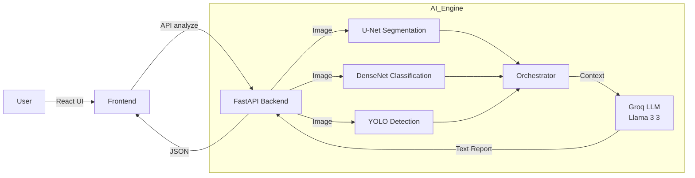

# 🫁 Multimodal AI - Trợ Lý Chẩn Đoán Hình Ảnh (PneumoScan AI)

> Ứng dụng AI y tế tiên tiến kết hợp Computer Vision và Large Language Models (LLM) để hỗ trợ bác sĩ chẩn đoán viêm phổi chính xác từ ảnh X-quang và dữ liệu lâm sàng.


-F55036?style=for-the-badge&logo=pytorch&logoColor=white)


---

## 📖 Mục Lục

- [📖 Giới Thiệu](#-giới-thiệu-dự-án)
- [🌟 Tính Năng Chính](#-tính-năng-chính)
- [🏗️ Kiến Trúc Hệ Thống](#️-kiến-trúc-hệ-thống)
- [🛠️ Công Nghệ Sử Dụng](#️-công-nghệ-sử-dụng)
- [🚀 Hướng Dẫn Cài Đặt](#-hướng-dẫn-cài-đặt-và-chạy)
- [📖 Hướng Dẫn Sử Dụng](#-hướng-dẫn-sử-dụng)

---

## 📖 Giới Thiệu Dự Án

**PneumoScan AI** là một hệ thống hỗ trợ quyết định lâm sàng (CDSS) thế hệ mới. Không giống như các hệ thống AI truyền thống chỉ dựa vào hình ảnh, PneumoScan AI thực hiện **phân tích đa phương thức (multimodal)**:

1.  **Thị giác máy tính**: Xác định vị trí tổn thương và tính toán xác suất viêm phổi.
2.  **Lập luận y khoa**: Tổng hợp dữ liệu bệnh nhân (xét nghiệm máu, sinh hiệu) cùng kết quả phân tích ảnh để đưa ra chẩn đoán và khuyến nghị như một chuyên gia y tế thực thụ.

---

## 🌟 Tính Năng Chính

### 🏥 Phân Tích Đa Phương Thức
- **Dữ liệu hình ảnh**: Xử lý ảnh X-quang ngực thẳng (PA/AP).
- **Dữ liệu lâm sàng**: Tích hợp các chỉ số quan trọng như Bạch cầu (WBC), CRP, SpO2, Tuổi, v.v.

### 🤖 Core AI Engine (Backend)
- **Phân Loại (Classification)**: Sử dụng **DenseNet121** để xác định xác suất viêm phổi.
- **Phân Vùng (Segmentation)**: Sử dụng **U-Net** (ResNet34 backbone) để tách vùng phổi, loại bỏ nhiễu từ xương/mô mềm.
- **Phát Hiện (Detection)**: Sử dụng **YOLOv8** để khoanh vùng (Bounding Box) các đám mờ bất thường.
- **Tổng Hợp (Reasoning)**: Sử dụng **LLM Llama 3.3 (via Groq Cloud)** để đóng vai trò bác sĩ, tổng hợp báo cáo.

### 📊 Đánh Giá Rủi Ro Tự Động
- Tự động tính điểm **CURB-65** / **CRB-65** để đánh giá mức độ nghiêm trọng.
- Phân tầng rủi ro (Ngoại trú vs Nhập viện).

---

## 🏗️ Kiến Trúc Hệ Thống



---

## 🛠️ Công Nghệ Sử Dụng

### Frontend 🎨
*   **React 19**: Library UI mới nhất.
*   **Vite**: Build tool siêu tốc.
*   **TypeScript**: Đảm bảo type-safety cho dữ liệu y tế.
*   **TailwindCSS**: Styling hiện đại, responsive.

### Backend ⚙️
*   **FastAPI**: Python web framework hiệu năng cao.
*   **PyTorch & TensorFlow**: Chạy các model AI chuyên biệt.
*   **Albumentations / OpenCV**: Xử lý ảnh y tế.
*   **Groq Cloud API**: Chạy mô hình ngôn ngữ lớn (LLM) với tốc độ thời gian thực.

---

## 🚀 Hướng Dẫn Cài Đặt và Chạy

### 1️⃣ Thiết lập Backend

```bash
cd backend

# Tạo môi trường ảo (Khuyến nghị)
python -m venv venv
venv\Scripts\activate   # Windows

# Cài đặt thư viện
pip install -r requirements.txt
```

**Cấu hình Environment:**
Tạo file `.env` trong thư mục `backend/` dựa trên mẫu bên dưới. **Quan trọng**: Cần có API Key của Groq.

```ini
# .env
GROQ_API_KEY=gsk_your_groq_api_key_here
PORT=8000
HOST=0.0.0.0
# Model Paths (Optional - use defaults if models are in model_ai/)
# UNET_PATH=path/to/unet.pth
```

**Chạy Server:**
```bash
python main.py
# Server chạy tại: http://localhost:8000
```

### 2️⃣ Thiết lập Frontend

```bash
cd frontend

# Cài đặt packages
npm install

# Chạy dev server
npm run dev
# App chạy tại: http://localhost:5173
```

---

## 📖 Hướng Dẫn Sử Dụng

1.  Mở trình duyệt tại `http://localhost:5173`.
2.  Nhập thông tin bệnh nhân (Tuổi, Nhiệt độ, SP02...).
3.  Upload ảnh X-quang.
4.  Nhấn **Analyze**. Hệ thống sẽ:
    *   Hiển thị vùng tổn thương trên ảnh.
    *   Đưa ra chẩn đoán xác suất.
    *   Viết báo cáo chi tiết kèm khuyến nghị điều trị.
